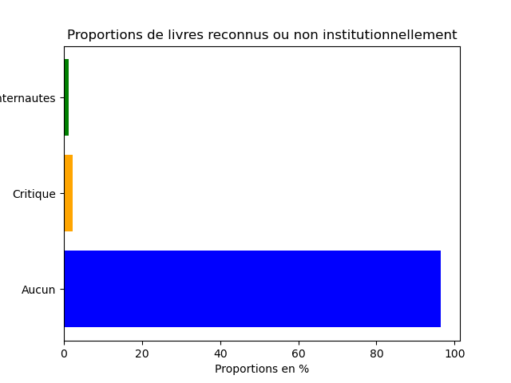

# Projet Python

**Projet réalisé dans le cadre du cours "Python pour la data science" de la 2e année du cursus ingénieur de l'ENSAE**

Réalisé par [@marieensae](https://github.com/marieensae), [@manonmgd](https://github.com/manonmgd), [@dianesaint](https://github.com/dianesaint)

L'intégralité de l'analyse est disponible [ici](https://github.com/manonmgd/pythonds_MM_MM_DS/blob/main/analyse_de_donn%C3%A9es.ipynb)

Chaque année, les livres reçoivent des centaines de prix littéraires, témoins de leur qualité, de leur impact ou de leur originalité. Cependant, ces distinctions ne sont pas les seuls moteurs de la popularité des ouvrages : l'influence des réseaux sociaux, comme YouTube à travers sa communauté "Booktube", joue un rôle croissant dans la mise en avant de certains livres auprès du grand public. Ce projet vise à identifier les déterminants de la popularité des livres en combinant l'étude des prix littéraires et l'analyse de l'impact des influenceurs sur YouTube.

## Prérequis

Tout d'abord, lancer la commande `pip install -r requirements.txt` afin d'installer les packages nécessaires. 

### Creation d'un projet sur Google Cloud Console

**Pour utiliser, la YouTube Data API v3 qui nous servira par la suite, il est nécessaire de créer un projet sur Google Cloud Console.**

Etape 1 : Créer un projet sur Google Cloud Console
-Aller sur [la Google Cloud Console](https://console.cloud.google.com).
-Créer un nouveau projet en cliquant sur "Select a project" puis "New Project".
-Donner un nom à votre projet et cliquer sur "Create".

Etape 2 : Activer l'API YouTube Data
-Aller dans le "API & Services" > "Library" dans la Google Cloud Console.
-Chercher YouTube Data API v3 et cliquez dessus.
-Cliquer sur "Enable" pour activer l'API.

Etape 3 : Créer des identifiants pour l'API
- Aller dans "API & Services" > "Credentials".
- Cliquer sur "Create Credentials" et choisir "API key".
- L'API key générée apparaîtra. Copier cette clé, vous en aurez besoin pour effectuer des requêtes.

## Méthodologie 

Le détail de la création de la base de donnée se trouve dans [ce fichier](https://github.com/manonmgd/pythonds_MM_MM_DS/blob/main/cr%C3%A9ation_base.ipynb)

Nous exploitons des données issues de scrapping et d'API pour analyser la consommation réelle de livres. Cela inclut les  classements mensuels du top 10 des ventes de la Fnac en 2023, le top 23 des livres les plus lus sur Babelio, ainsi que les 100 ouvrages les plus empruntés dans une bibliothèque parisienne. En parallèle, nous avons collecté des informations sur les prix littéraires, en distinguant d'une part les prix institutionnels français des cinq dernières années (provenant de Wikipédia), et d'autre part les livres primés par les internautes sur le réseau social littéraire Livraddict. Enfin, nous avons croisé ces données avec des informations issues de l'API YouTube pour évaluer si les livres populaires en 2023 (qu'ils soient appréciés ou simplement consommés) ont été mis en avant sur la communauté Booktube.

Le scrapper, à chaque fois scrapp et stock dans un fichier csv:
- 23 livres dans la base `babelio.csv`
- 70 livres dans la base `best_sellers_fnac_2023_cleaned.csv`
- 86 dans `livraddict_prix_2024.csv`
- 265 livres dans `prix_litteraires.csv`

Dans l'API de la bibliothèque nous avons récupéré les 100 emprunts les plus fréquents auxquels nous avons retiré les DVD. Nous avons donc 87 livres dans la base `les_livres_les_plus_empruntes_a_paris.csv`

Une fois les bases de données fusionnées il nous reste 492 livres dans la base `base_finale.csv`

> rajouter partie youtube

## Etude de la consommation de livres

Tout d'abord, nous avons pu noter que les livres reconnus institutionnellement notamment par des prix et ceux qui étaient reconnus par les internautes n'étaient pas nécessairement les mêmes 

      
   [Source](https://github.com/manonmgd/pythonds_MM_MM_DS/blob/main/analyse_de_donn%C3%A9es.ipynb)

## Influence de Booktube sur la consommation de livres

## Conclusion

